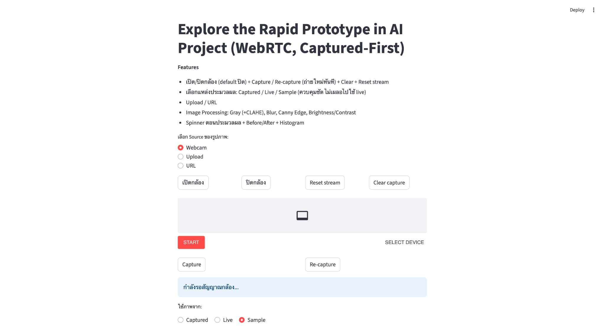
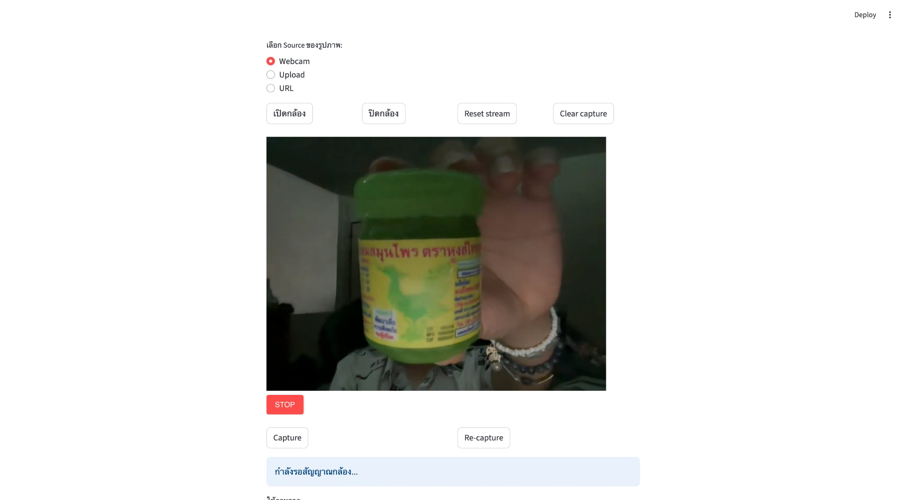
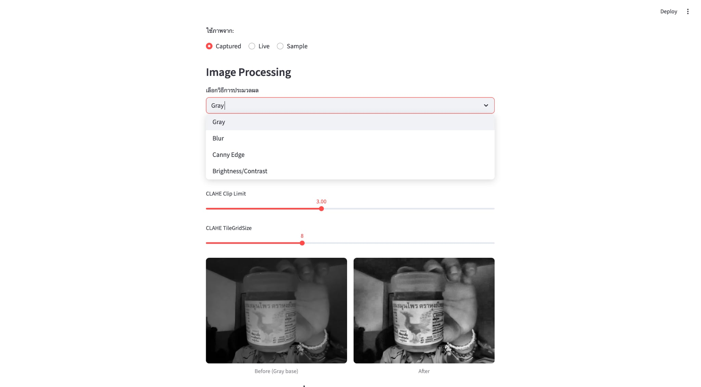
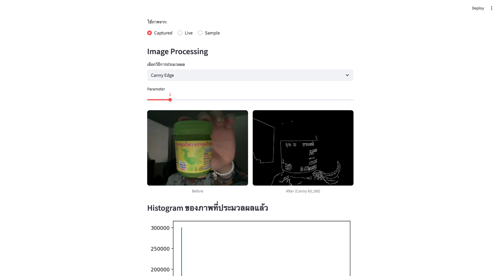
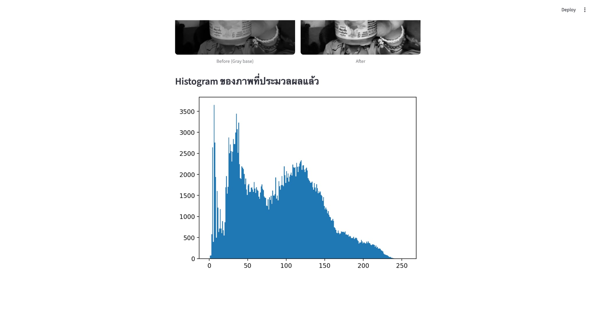

# Explore the Rapid Prototype in AI Project

โปรเจกต์นี้พัฒนาด้วย **Streamlit** เพื่อตอบโจทย์การสร้าง Rapid Prototype ด้าน AI/Computer Vision 

---

## Features
- เปิด/ปิดกล้องผ่านเบราว์เซอร์ (WebRTC) พร้อมปุ่ม **Capture / Re-capture / Reset**
- รองรับการใช้งานภาพจาก **Webcam / Upload / URL / Sample image**
- Image Processing อย่างง่าย:
  - Grayscale (Plain + CLAHE Enhancement)
  - Gaussian Blur
  - Canny Edge Detection
  - Brightness/Contrast Adjustment
- ปรับ **Parameter** ได้ผ่าน GUI เช่น kernel size, threshold, brightness/contrast
- แสดงผล **Before → After** เทียบกันแบบ side-by-side
- แสดง **Histogram** ของภาพที่ประมวลผลแล้วแบบอัตโนมัติ

---

## Installation

1. Clone repo นี้
   ```bash
   git clone https://github.com/xooooiz7/streamlit-image-lab.git
   cd streamlit-image-lab
2. สร้าง virtual environment
    ```bash
    python3 -m venv venv
    source venv/bin/activate   # macOS / Linux
    venv\Scripts\activate      # Windows
3. ติดตั้ง dependency
    ```bash
    pip install -r requirements.txt
4. รันแอป
    ```bash
    streamlit run app.py






